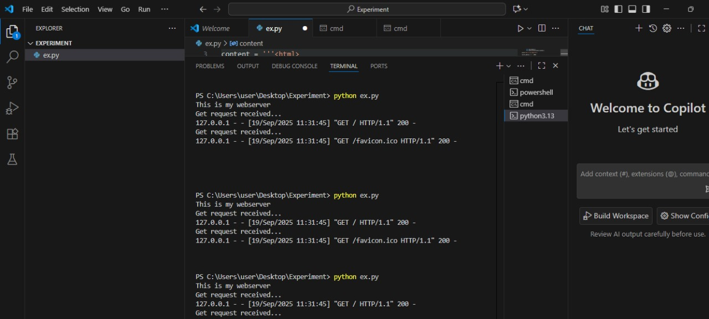
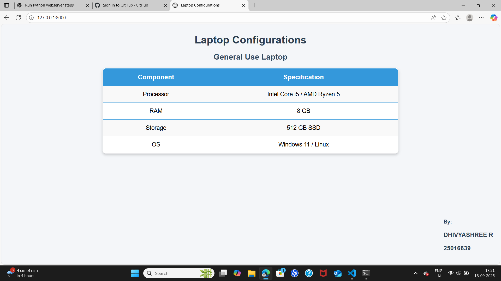

**EX01 Developing a Simple Webserver**

**Date:**
19-09-2025

**AIM:**
To develop a simple webserver to serve HTML pages and display the configuration details of a laptop.

**DESIGN STEPS:**

**step 1:**
HTML content creation.

**Step 2:**
Design of webserver workflow.

**Step 3:**
Implementation using Python code.

**Step 4:**
Serving the HTML pages.

**Step 5:**
Testing the webserver.
```
###PROGRAM:
from http.server import HTTPServer, BaseHTTPRequestHandler

content = '''<!DOCTYPE html>
<html>
<head>
    <title>Laptop Configurations</title>
</head>
<body>
    <h1>Laptop Configurations</h1>
    <h2>General Use Laptop</h2>
    <tableborder="1">
        <tr><th>Component</th><th>Specification</th></tr>
        <tr><td>Processor</td><td>Intel Core i5 / AMD Ryzen 5</td></tr>
        <tr><td>RAM</td><td>8 GB</td></tr>
        <tr><td>Storage</td><td>512 GB SSD</td></tr>
        <tr><td>OS</td><td>Windows 11 / Linux</td></tr>
    </table>
</body>
</html>'''

class MyServer(BaseHTTPRequestHandler):
    def do_GET(self):
        print("Get request received ...")
        self.send_response(200)
        self.send_header('Content-type', 'text/html')
        self.end_headers()
        self.wfile.write(content.encode())

print("This is my webserver")
server_address = ('', 8000)
httpd = HTTPServer(server_address, MyServer)
httpd.serve_forever()
```
### output:



### RESULT:
The program for implementing simple webserver is executed successfully.
